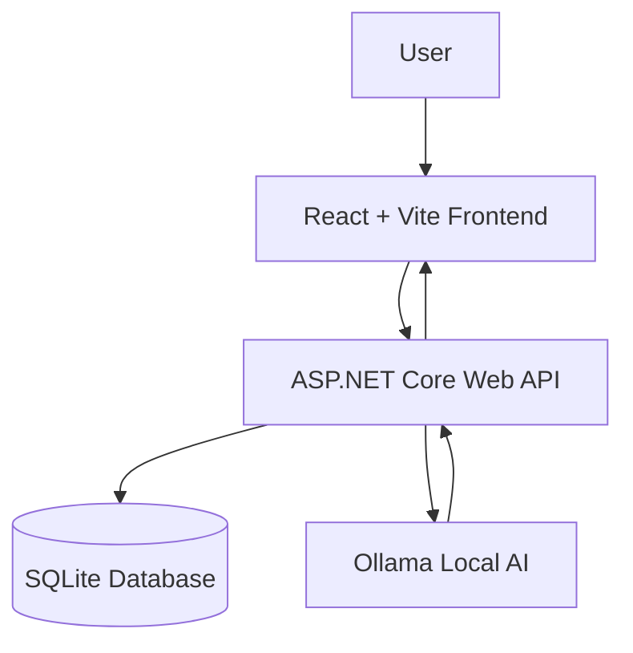

# Lunar Probe Intelligence (LPI)

**Investigate Claims. Examine Evidence. Understand the Difference.**

Lunar Probe Intelligence (LPI) is a local-first, AI-powered evidence analysis application. It helps users investigate claims by examining how individual passages of documentary evidence relate to them.

> **Note:** LPI is an evidence analysis tool. It does not guarantee the truth or falsity of any claim, and its AI-generated output should always be reviewed against the original source material.

---

## Table of Contents

1. [Overview](#overview)
2. [Why LPI?](#why-lpi)
3. [Features](#features)
4. [How It Works](#how-it-works)
5. [Example Investigation: Apollo 13](#example-investigation-apollo-13)
6. [Technology Stack](#technology-stack)
7. [System Architecture](#system-architecture)
8. [Installation and Setup](#installation-and-setup)
9. [API Documentation](#api-documentation)
10. [Testing](#testing)
11. [Current Limitations](#current-limitations)
12. [Privacy and Local Processing](#privacy-and-local-processing)
13. [Future Improvements](#future-improvements)
14. [License](#license)

---

## Overview

LPI lets users create research sessions, add text-based evidence documents, extract candidate statements, select claims for investigation, and evaluate passages from other documents against those claims.

Using locally hosted AI through [Ollama](https://ollama.com), LPI analyzes the relationship between a claim and a selected evidence passage. It classifies the relationship, generates an explanation, estimates evidence strength and uncertainty, and keeps references to the source document and passage.

The goal is to help users organize information, examine evidence systematically, and understand what the available evidence supports, contradicts, or leaves unresolved.

---

## Why LPI?

| Characteristic | Description |
|---|---|
| **Claim-centered analysis** | A specific claim is evaluated against a specific passage, rather than producing only a general answer about a topic. |
| **Explicit evidence relationships** | The *Supports*, *Contradicts*, and *Context* categories make the relationship between claim and passage easy to review. |
| **Evidence traceability** | Users can trace an assessment back to its source document and selected passage. |
| **Local AI processing** | Ollama runs AI inference on the user's machine, reducing dependence on external AI inference APIs. |
| **Transparent limitations** | The application acknowledges when evidence is insufficient and does not treat AI output as definitive proof. |

LPI does not claim to have verified factual accuracy, eliminated AI hallucinations, or guaranteed reliable conclusions.

---

## Features

### Implemented

| Feature | Description |
|---|---|
| **Research sessions** | Create sessions centered on a research question or topic. A session is a workspace for documents, candidate claims, and evidence assessments. |
| **Evidence documents** | Add text-based evidence documents to a session and review their contents. |
| **Candidate claim extraction** | Document text is split into sentences to produce candidate statements. Users review them and select one to investigate. |
| **Claim selection** | Select a candidate claim to evaluate against a passage from a *different* evidence document. |
| **Evidence passage selection** | Choose a separate document and specify the passage using a starting character offset and passage length. |
| **Local AI assessment** | The backend sends the claim and passage to a model hosted via Ollama. The model is instructed to evaluate the relationship using only the supplied text, without inventing facts or citations. |
| **Relationship classification** | Each assessment is classified as *Supports*, *Contradicts*, or *Context*. |
| **Evidence-strength assessment** | Each assessment is labeled *Direct*, *Indirect*, or *Insufficient*. |
| **Uncertainty assessment** | Each assessment carries an uncertainty estimate of *Low*, *Moderate*, or *High*. |
| **Explanations and limitations** | The AI explains its classification and can indicate why a passage does not adequately establish a claim. |
| **Source traceability** | Assessments reference source documents and passage locations using character offsets and passage lengths. |
| **Relationship management** | Save, review, and delete evidence relationships. A stored relationship associates a candidate claim with a source document and a specific evidence passage. |
| **Health check** | The API exposes a health-check endpoint. |

### Backend-only

| Feature | Description |
|---|---|
| **Multi-passage assessment API** | The backend can evaluate between two and five passages and summarize classifications, evidence-strength categories, uncertainty categories, and potential conflicts. This is **not yet fully integrated into the frontend**, and its comparison output is not automatically saved as a complete assessment history. |

### Classification reference

**Relationship classifications**

| Classification | Meaning | Caveat |
|---|---|---|
| **Supports** | The passage provides evidence in favor of the claim. | Does not necessarily mean the whole claim has been proven. |
| **Contradicts** | The passage provides evidence against the claim. | Does not automatically mean the claim is completely false. |
| **Context** | The passage is related to the claim but is insufficient to establish support or contradiction. | Relevant information does not necessarily determine whether a claim is accurate. |

**Evidence strength**

| Label | Meaning |
|---|---|
| **Direct** | The passage directly addresses the claim. |
| **Indirect** | The passage provides related or circumstantial evidence. |
| **Insufficient** | The passage does not provide enough information to evaluate the claim adequately. |

**Uncertainty**

| Level | Notes |
|---|---|
| **Low** / **Moderate** / **High** | These represent the AI model's own assessment. They are not statistically calibrated confidence scores unless independently validated. |

All of these labels are AI-generated assessments, not objective measurements or guarantees.

---

## How It Works

1. **Create a research session.** Enter a research question or topic.
2. **Add evidence documents.** Supply text containing relevant information.
3. **Extract candidate claims.** The application splits the document text into candidate statements.
4. **Select a claim.** Choose a statement that needs further investigation.
5. **Select evidence.** Choose a different document and specify a passage by starting character offset and length.
6. **Run the assessment.** The backend uses Ollama to analyze the claim and passage.
7. **Review the result.** Examine the classification, explanation, evidence strength, and uncertainty.
8. **Save the relationship.** Preserve the finding for later review.

Users choose the evidence passages themselves. LPI does not search the internet or retrieve external sources. Users should verify the AI's interpretation against the original text.

---

## Example Investigation: Apollo 13

> **The scenarios below are illustrative.** They use hypothetical passages and are not verified quotations or findings from actual NASA documents.

**Research question:** Did the Apollo 13 crew return to Earth using only the lunar module?

**Candidate claim:** "The Apollo 13 crew returned to Earth using only the lunar module."

| Example | Hypothetical passage | Possible assessment |
|---|---|---|
| **A: Supporting evidence** | Describes how the lunar module supplied life-support functions and supported the crew during the emergency. | **Supports** some aspect of the claim, but does not establish that the lunar module was used exclusively throughout the return. |
| **B: Contradictory evidence** | Describes the command module's role during the final stages of the mission and the crew's return. | May **contradict** the claim's use of the word "only," depending on what the passage establishes. |
| **C: Context** | Gives the mission's launch date. | **Context**, with insufficient evidence to determine whether the claim is accurate. |

The actual assessment always depends on the content, relevance, and completeness of the passage supplied to the application.

---

## Technology Stack

| Component | Technology | Purpose |
|---|---|---|
| Frontend | React | User interface |
| Frontend tooling | Vite | Development server and build tooling |
| Backend | C# and ASP.NET Core Web API | API endpoints and application logic |
| Database | SQLite | Persistent application data |
| AI inference | Ollama | Running AI models locally |
| Communication | HTTP API | Frontend-to-backend communication |

Specific framework and package versions are **not documented here** and need to be confirmed from the project's manifests (for example, the backend project file and the frontend `package.json`).

---

## System Architecture

The React frontend communicates with the ASP.NET Core Web API. The backend manages application data through SQLite and uses Ollama for local AI-powered evidence assessment.

---

## Installation and Setup

> **Requires confirmation.** The exact project paths, .NET SDK version, Node.js version, Ollama model name, API port, frontend port, database initialization procedure, and configuration setting names have not been documented. Exact commands and settings must be confirmed against the repository before they can be listed reliably. This section is intentionally a checklist rather than a set of commands.

Things a developer needs to confirm and complete:

- [ ] Install **Git**.
- [ ] Install a compatible **.NET SDK** (version to be confirmed).
- [ ] Install **Node.js and npm** (version to be confirmed).
- [ ] Install **Ollama**.
- [ ] Obtain a model compatible with the application's configured Ollama model name (name to be confirmed).
- [ ] Restore and run the ASP.NET Core API from its actual project directory.
- [ ] Install frontend dependencies using the frontend's package manifest.
- [ ] Start the React + Vite development server.
- [ ] Confirm the frontend is configured to communicate with the running backend.
- [ ] Verify that SQLite initializes correctly (automatic or manual initialization to be confirmed).
- [ ] Test the API health endpoint and the local AI assessment workflow.

---

## API Documentation

The ASP.NET Core backend exposes API endpoints for the application's research and evidence workflows. The known endpoint groups are:

| Group | Purpose |
|---|---|
| Health checks | Confirm the API is running |
| Research sessions | Create and retrieve research sessions |
| Evidence documents | Add and review evidence documents |
| Candidate claims | Extract and list candidate claims |
| Claim assessments | Assess a claim against a selected passage |
| Evidence relationships | Save, review, and delete evidence relationships |

> **Requires confirmation.** Route paths, HTTP methods, request bodies, authentication requirements, and response schemas are not documented here. The complete API reference must be filled in from the controller definitions or from the application's Swagger/OpenAPI documentation, if configured.

---

## Testing

No automated test coverage or test results are claimed here. The following are **recommended verification steps**, not proof that tests have passed:

- Research sessions can be created and retrieved.
- Evidence documents can be added and reviewed.
- Candidate claims can be extracted.
- Claims can be assessed against passages from different documents.
- The AI can return each supported relationship category.
- Assessment explanations and metadata are displayed correctly.
- Evidence relationships can be saved and reviewed.
- The health endpoint responds correctly.
- Ollama is reachable and the configured model can produce an assessment.

---

## Current Limitations

These describe the current known scope and are not permanent constraints.

- Candidate claim extraction relies on **sentence segmentation**, not semantic claim detection, so it does not reliably isolate independently verifiable factual claims.
- Users manually supply text evidence and select passages.
- AI classifications may be incorrect, incomplete, or sensitive to the supplied context.
- A related passage does not necessarily prove or disprove a claim.
- Evidence-strength and uncertainty categories are AI-generated estimates.
- Source traceability uses document references and character offsets. Page numbers, paragraph-level citations, and external-source URLs are not provided.
- Automatic internet research and evidence retrieval are not implemented in the described workflow.
- PDF and Word document parsing are not confirmed as available.
- A consolidated research report is not currently part of the described feature set.
- Multi-passage assessment is available in the backend but is not fully integrated into the frontend.

---

## Privacy and Local Processing

LPI uses Ollama for local AI inference when Ollama is configured to run on the user's machine. This reduces the need to send evidence passages to an external AI inference provider.

LPI does **not** promise complete privacy, total offline operation, or zero network communication. Those properties depend on the application's configuration, dependencies, and runtime behavior.

---

## Future Improvements

The following are **potential future improvements**, not implemented features:

- More sophisticated semantic claim extraction.
- Frontend integration for multi-passage assessment.
- Better validation of contradictory evidence.
- Support for PDF and Word documents.
- Improved passage provenance and citation navigation.
- Consolidated research summaries and exportable reports.
- Expanded assessment testing and evaluation.

---

## License

The project's license has not been specified in this documentation.
